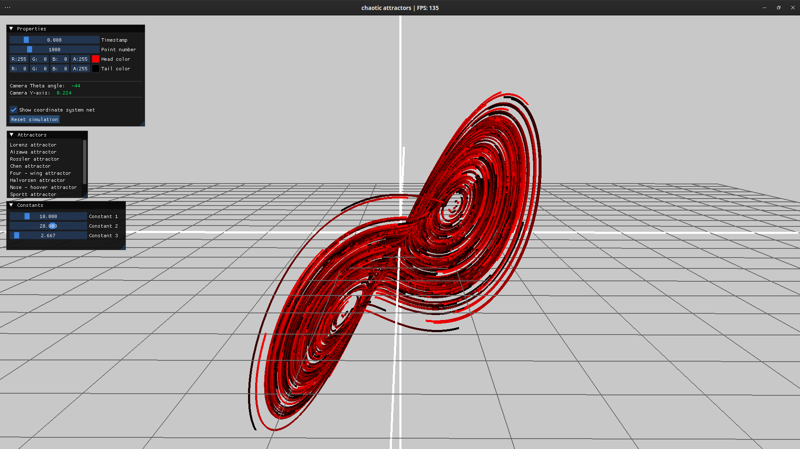
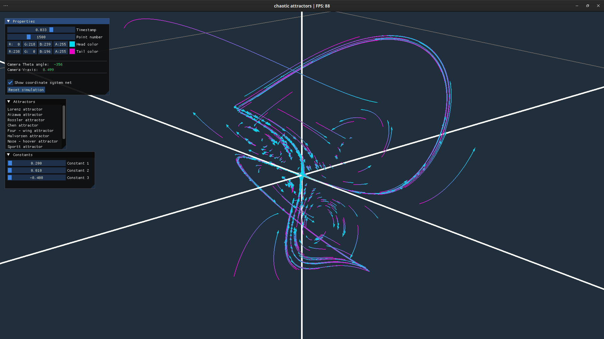
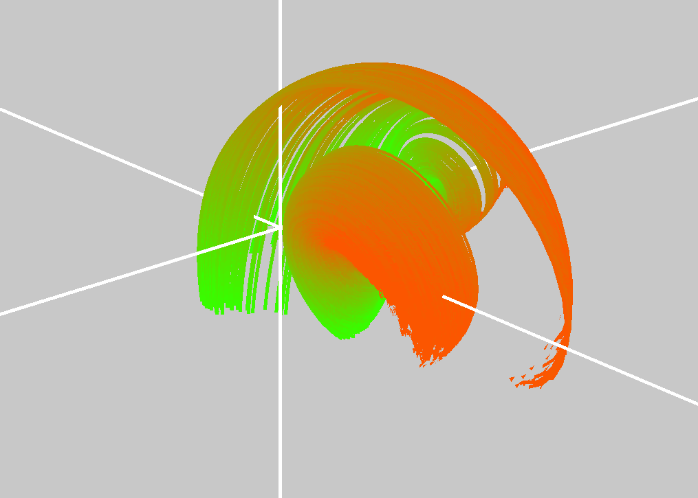

# Chaotic attractors #

Interactive simulation of chosen chaotic attractors written in OpenGL/C++ using following libraries: 
* __GLFW__
* __GLM__
* __ImGui__

Attractors shown in simulation:
* _lorenz_
* _halovrsen_
* _chen_
* _four-wing_
* _sprott_
* _thomas_
* _dadras_
* _nose - hoover_
* _aizawa_
* _rossler_

------------------------------------------------------------------------------------------------

------------------------------------------------------------------------------------------------

------------------------------------------------------------------------------------------------

------------------------------------------------------------------------------------------------

- [ ] Add installation/build info
- [ ] Upload a couple of images of the simulation
